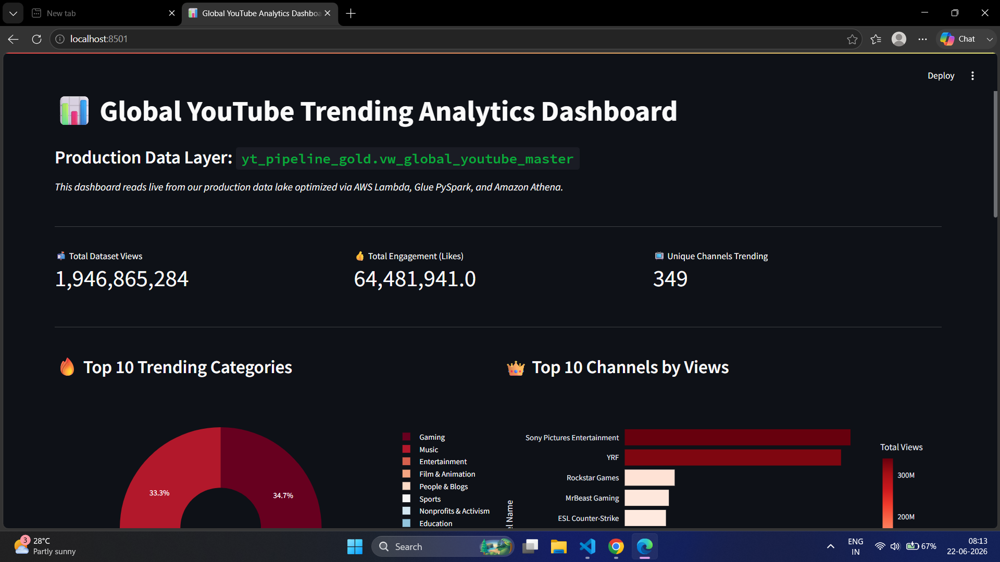
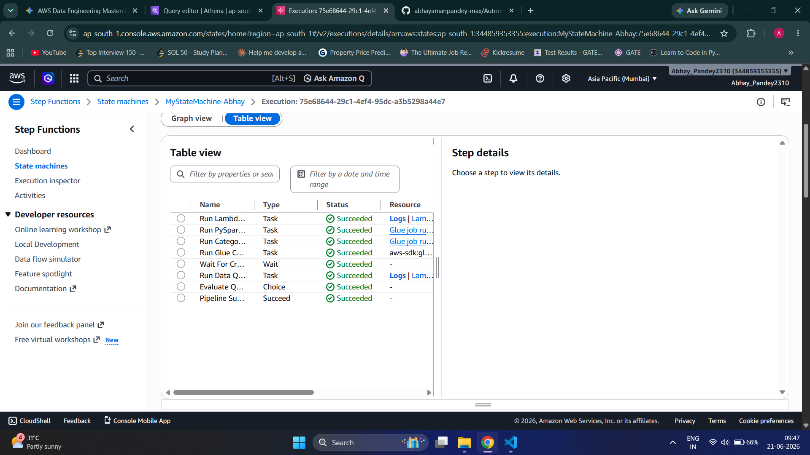
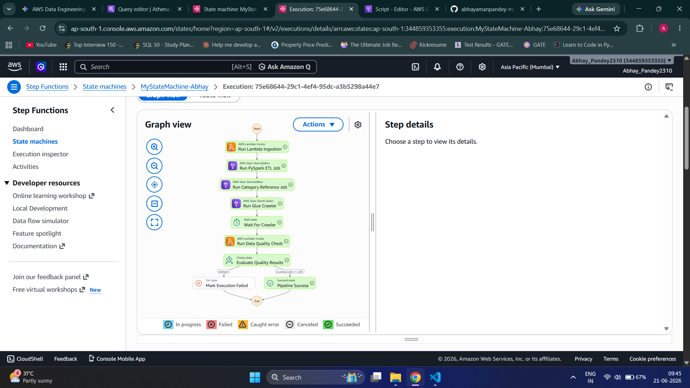

# Automated YouTube Trending Data Pipeline Architecture

An enterprise-grade, serverless data engineering pipeline designed to ingest, transform, catalog, and model unstructured YouTube trending metrics dynamically using AWS.

## 🏗️ Architecture Design Flow

1. **Ingestion Layer:** AWS Lambda functions wake up to extract raw global data streams into an Amazon S3 Bronze bucket.
2. **Orchestration Layer:** AWS Step Functions orchestrates state changes sequentially and securely.
3. **Processing Layer (ETL):** Apache Spark jobs run via AWS Glue to correct broken multi-line text shifts and pack records into highly compressed Apache Parquet tables (Silver/Gold layers).
4. **Data Cataloging:** An AWS Glue Crawler runs automatically to index schemas.
5. **Analytical Layer:** Amazon Athena maps statistics to JSON metadata configurations on the fly using specialized `VARCHAR` data-type casting.

## 🎥 Project Demo

[](https://youtu.be/OB1Nv6EgMsM)

*Click the thumbnail above to watch a full walkthrough of the pipeline — from S3 ingestion through Lambda, Glue, Athena, and Step Functions orchestration to the final Streamlit dashboard.*

## 📊 Analytics Dashboard Layer (Streamlit)

An interactive, live **Global YouTube Trending Analytics Dashboard** built using **Streamlit** and **Plotly** serves as the presentation and data application layer for this production pipeline. 

It consumes the optimized, consumption-ready data (Gold Layer) generated from the AWS pipeline (`yt_pipeline_gold.vw_global_youtube_master`).

---
### 📸 Dashboard Screenshots

#### 1. Key Performance Indicators & Category Analysis


#### 2. Top Channels Analysis


#### 3. Viral Engagement Matrix & Raw Data Inspector


---

### 🚀 Features Included
* **Top KPIs Metric Row:** High-level visibility into *Total Dataset Views*, *Total Engagement (Likes)*, and *Unique Channels Trending*.
* **Top 10 Trending Categories:** A dynamic donut chart visualizing video distributions across trending categories.
* **Top 10 Channels by Views:** A horizontal bar chart identifying the top-performing channels.
* **Viral Engagement Matrix:** A Plotly scatter/bubble plot mapping *Views vs. Likes*, where bubble sizes reflect *Comment Counts*, segmented by category.
* **Raw Data Inspector:** An expandable interactive data table (`st.dataframe`) to explore the complete gold dataset directly within the UI.

---

### 🛠️ Setup and Run the Dashboard Locally

Follow these steps to spin up the analytics interface on your local machine:

1. **Navigate to the Dashboard Directory:**
   ```bash
   cd Dashboard
2. **Install Dependencies:**
    Make sure you have Python installed, then run:
    ```bash
    pip install streamlit pandas plotly
4. **Verify Dataset Path:**
    Ensure your localized dataset cleaned_youtube_trending_data.csv.csv is present in your workspace     directory so that the load_data() function can read the cached Athena export successfully:
    ```bash
    #Inside app.py
   df = pd.read_csv("cleaned_youtube_trending_data.csv.csv")
 6. **Launch the Dashboard:**
    ```bash
      streamlit run app.py
 ---
## 🏗️ Pipeline Architecture Flow

[AWS S3 / Lambda] ➔ [Glue PySpark ETL] ➔ [Amazon Athena (Gold View)] ➔ [Local/Deployed Streamlit Dashboard]

 ---
   
## 🟢 Automated Deployment Success

Below are the verified execution logs of the state machine, demonstrating a flawless pipeline flow from raw ingestion to production modeling:

#### Execution Table View
This shows the linear completion and data pass-through of every major state:


#### Execution Graph View
This visualization maps the success path (Green trail) through the synchronous data processing and validation steps:


## 🛠️ Repository Components

* `step_function_definition.json` - Complete Amazon States Language (ASL) automated logic flow.
* `athena_master_view.sql` - Production Presto SQL views mapping keys to categories safely.

# YouTube Trending Data Pipeline

A cloud-native ETL pipeline that ingests YouTube trending video data across 10 regions, transforms it through a medallion architecture (Bronze > Silver > Gold), enforces data quality gates, and produces analytics-ready aggregations — all orchestrated by AWS Step Functions.


---

## Table of Contents

- [Overview](#overview)
- [Architecture](#architecture)
- [Tech Stack](#tech-stack)
- [Project Structure](#project-structure)
- [Data Flow](#data-flow)
  - [Bronze Layer (Raw Data)](#bronze-layer-raw-data)
  - [Silver Layer (Cleansed Data)](#silver-layer-cleansed-data)
  - [Data Quality Gate](#data-quality-gate)
  - [Gold Layer (Business Aggregations)](#gold-layer-business-aggregations)
- [Gold Layer Output Tables](#gold-layer-output-tables)
- [Prerequisites](#prerequisites)
- [AWS Infrastructure Setup](#aws-infrastructure-setup)
- [Configuration](#configuration)
- [Deployment](#deployment)
- [Running the Pipeline](#running-the-pipeline)
- [Monitoring and Alerting](#monitoring-and-alerting)
- [Supported Regions](#supported-regions)
- [Data Sources](#data-sources)

---

## Overview

This pipeline automates the end-to-end process of collecting, cleaning, and analyzing YouTube trending video data. It replaces manual Kaggle dataset downloads with live YouTube Data API v3 integration and produces three sets of business analytics tables:

- **Trending Analytics** — daily trending metrics per region (total videos, views, engagement rates)
- **Channel Analytics** — channel-level performance and ranking across regions
- **Category Analytics** — category-level breakdowns with view share percentages

The pipeline supports **10 regions** and runs on a configurable schedule via AWS EventBridge.

---

## Architecture

The pipeline follows the **Medallion Architecture** pattern with three data layers:

```
Data Sources          Bronze              Silver            Quality Gate          Gold              Analytics
┌──────────┐     ┌──────────────┐    ┌──────────────┐    ┌────────────┐    ┌──────────────┐    ┌──────────┐
│ YouTube  │     │              │    │              │    │            │    │  trending_   │    │          │
│ API v3   │────>│  Raw JSON    │───>│  Cleansed    │───>│  DQ Lambda │───>│  analytics   │───>│  Athena  │
│          │     │  (S3)        │    │  Parquet     │    │  Validates │    │              │    │          │
├──────────┤     │              │    │  (S3)        │    │  row count │    │  channel_    │    ├──────────┤
│ Kaggle   │     │  Raw CSV     │    │              │    │  nulls     │    │  analytics   │    │  Quick-  │
│ Dataset  │────>│  (S3)        │    │  Reference   │    │  schema    │    │              │    │  Sight   │
│          │     │              │    │  Parquet     │    │  freshness │    │  category_   │    │          │
└──────────┘     └──────────────┘    └──────────────┘    └────────────┘    │  analytics   │    └──────────┘
                                                              │           └──────────────┘
                                                         fail │
                                                              ▼
                                                        ┌────────────┐
                                                        │  SNS Alert │
                                                        └────────────┘
```

**Orchestration** is handled by AWS Step Functions, which coordinates the full pipeline with retry logic, parallel execution, and failure notifications.

---

## Tech Stack

| Component           | Technology                          |
|---------------------|-------------------------------------|
| **Compute**         | AWS Lambda, AWS Glue (PySpark)      |
| **Storage**         | Amazon S3 (Parquet, Snappy)         |
| **Orchestration**   | AWS Step Functions                  |
| **Scheduling**      | Amazon EventBridge                  |
| **Metadata**        | AWS Glue Data Catalog               |
| **Query Engine**    | Amazon Athena                       |
| **Alerting**        | Amazon SNS                          |
| **Monitoring**      | Amazon CloudWatch                   |
| **Security**        | AWS IAM                             |
| **Languages**       | Python 3, PySpark, SQL              |
| **Libraries**       | Pandas, AWS Wrangler, Boto3         |
| **Data Format**     | Parquet (Snappy compression)        |

---

## Project Structure

```
youtube-data-pipeline-2026/
│
├── lambdas/
│   ├── youtube_api_integstion/        # Ingestion Lambda
│   │   └── lambda_function.py         # Fetches trending videos & categories from YouTube API
│   └── json_to_parquet/               # Reference data transformation Lambda
│       └── lambda_function.py         # Converts JSON category mappings to Parquet
│
├── glue_jobs/
│   ├── bronze_to_silver_statistics.py # PySpark job: raw data → cleansed statistics
│   └── silver_to_gold_analytics.py    # PySpark job: cleansed data → business aggregations
│
├── data_quality/
│   └── dq_lambda.py                   # Data quality validation Lambda
│
├── step_functions/
│   └── pipeline_orchestation.json     # Step Functions state machine definition
│
├── scripts/
│   ├── aws_copy.sh                    # Upload historical data to Bronze S3 bucket
│   └── information.md                 # AWS resource names & configuration reference
│
├── data/                              # Reference & historical data
│   ├── {region}videos.csv             # Kaggle trending video datasets (10 regions)
│   └── {region}_category_id.json      # YouTube category ID mappings (10 regions)
│
└── YouTube Trending Data Pipeline.png # Architecture diagram
```

---

## Data Flow

### Bronze Layer (Raw Data)

The ingestion Lambda (`Automated-youtube-data-piepline-aws-s3-lambda-glue-athena-stepfunction/lambdas/ingestion_lambda.py`) fetches data from the YouTube Data API v3:

- **Trending videos** — top 50 trending videos per region
- **Category mappings** — video category ID-to-name reference data

Data is stored as raw JSON in S3, partitioned by region, date, and hour:

```
s3://abhayytdatabuket/youtube/raw_statistics
s3://abhayytdatabuket/youtube/raw_statistics_reference_data
```

Historical Kaggle CSV data can also be uploaded to the Bronze layer via the `aws_copy.sh` script.

### Silver Layer (Cleansed Data)

Two parallel transformations run on Bronze data:

**1. Statistics (Glue Job: `bronze_to_silver_statistics`)**
- Schema enforcement across both API JSON and Kaggle CSV formats
- Type casting (views, likes, dislikes → Long; dates parsed)
- Null handling and region standardization
- Deduplication (latest record per video/region/date)
- Derived metrics: `like_ratio`, `engagement_rate`
- Output: Parquet with Snappy compression, partitioned by region

**2. Reference Data (Lambda: `json_to_parquet`)**
- Normalizes JSON category mappings to tabular format
- Deduplicates category entries
- Output: Parquet, partitioned by region

### Data Quality Gate

Before data moves to Gold, the DQ Lambda (`dq_lambda`) validates Silver data:

| Check              | Threshold                  |
|--------------------|----------------------------|
| Row count          | >= 10 rows                 |
| Null percentage    | <= 5% on critical columns  |
| Schema validation  | Required columns present   |
| Value ranges       | Views sanity check         |
| Data freshness     | < 48 hours since last data |

If any check fails, the pipeline halts and sends an **SNS alert** with failure details. Gold aggregation does not execute.

### Gold Layer (Business Aggregations)

The Glue job (`silver_to_gold_analytics`) produces three analytics tables from cleansed Silver data:

---

## Gold Layer Output Tables

### `trending_analytics`

Daily trending metrics aggregated per region.

| Column                | Description                          |
|-----------------------|--------------------------------------|
| `region`              | Country code (US, GB, IN, etc.)      |
| `trending_date_parsed`| Date of trending snapshot            |
| `total_videos`        | Number of trending videos            |
| `total_views`         | Sum of all views                     |
| `total_likes`         | Sum of all likes                     |
| `avg_views_per_video` | Average views per trending video     |
| `avg_like_ratio`      | Average like-to-view ratio           |
| `avg_engagement_rate` | Average engagement rate              |
| `unique_channels`     | Count of distinct channels           |
| `unique_categories`   | Count of distinct categories         |

### `channel_analytics`

Channel-level performance and ranking.

| Column               | Description                           |
|----------------------|---------------------------------------|
| `channel_title`      | YouTube channel name                  |
| `region`             | Country code                          |
| `total_videos`       | Videos that trended                   |
| `total_views`        | Total views across trending videos    |
| `avg_engagement_rate`| Average engagement rate               |
| `times_trending`     | Number of times appeared in trending  |
| `rank_in_region`     | Performance rank within the region    |
| `categories`         | Categories the channel appears in     |

### `category_analytics`

Category-level breakdowns with view share.

| Column               | Description                           |
|----------------------|---------------------------------------|
| `category`           | Video category name                   |
| `region`             | Country code                          |
| `trending_date_parsed`| Date of trending snapshot            |
| `video_count`        | Number of videos in category          |
| `total_views`        | Total views for the category          |
| `avg_engagement_rate`| Average engagement rate               |
| `view_share_pct`     | Percentage of total views             |

All Gold tables are stored as Parquet (Snappy compressed), partitioned by `region`, and registered in the Glue Data Catalog for Athena queries.

---

## Prerequisites

- **AWS Account** with permissions to create Lambda, Glue, S3, Step Functions, SNS, IAM, Athena, EventBridge, and CloudWatch resources
- **YouTube Data API v3 key** — obtain from the [Google Cloud Console](https://console.cloud.google.com/apis/credentials)
- **AWS CLI** configured with appropriate credentials
- **Python 3.9+**

---

## AWS Infrastructure Setup

Create the following S3 buckets:

```bash
aws s3 mb s3://yt-data-pipeline-bronze-<region>-<env>
aws s3 mb s3://yt-data-pipeline-silver-<region>-<env>
aws s3 mb s3://yt-data-pipeline-gold-<region>-<env>
aws s3 mb s3://yt-data-pipeline-script-<region>-<env>
```

Create Glue databases:

```bash
aws glue create-database --database-input '{"Name": "yt_pipeline_bronze_<env>"}'
aws glue create-database --database-input '{"Name": "yt_pipeline_silver_<env>"}'
aws glue create-database --database-input '{"Name": "yt_pipeline_gold_<env>"}'
```

Create an SNS topic for alerts:

```bash
aws sns create-topic --name yt-data-pipeline-alerts-<env>
aws sns subscribe --topic-arn <topic-arn> --protocol email --notification-endpoint <your-email>
```

---

## Configuration

### Environment Variables

#### Ingestion Lambda

| Variable            | Description                        | Example                                     |
|---------------------|------------------------------------|----------------------------------------------|
| `YOUTUBE_API_KEY`   | YouTube Data API v3 key            | `AIzaSy...`                                  |
| `S3_BUCKET_BRONZE`  | Bronze S3 bucket name              | `yt-data-pipeline-bronze-ap-south-1-dev`     |
| `YOUTUBE_REGIONS`   | Comma-separated region codes       | `US,GB,CA,DE,FR,IN,JP,KR,MX,RU`             |

#### Data Quality Lambda

| Variable                | Description                    | Default |
|-------------------------|--------------------------------|---------|
| `S3_BUCKET_SILVER`      | Silver S3 bucket name          | —       |
| `GLUE_DB_SILVER`        | Silver Glue database name      | `yt_pipeline_silver_dev` |
| `SNS_ALERT_TOPIC_ARN`   | SNS topic ARN for alerts       | —       |
| `DQ_MIN_ROW_COUNT`      | Minimum row count threshold    | `10`    |
| `DQ_MAX_NULL_PERCENT`   | Maximum null percentage allowed| `5.0`   |

#### Glue Jobs

Glue job parameters are passed via the Step Functions state machine or directly via `--arguments`:

| Parameter            | Description                     |
|----------------------|---------------------------------|
| `--bronze_database`  | Bronze Glue database name       |
| `--bronze_table`     | Bronze table name               |
| `--silver_database`  | Silver Glue database name       |
| `--silver_bucket`    | Silver S3 bucket name           |
| `--gold_database`    | Gold Glue database name         |
| `--gold_bucket`      | Gold S3 bucket name             |

---

## Deployment

### 1. Upload Glue job scripts to S3

```bash
aws s3 cp glue_jobs/bronze_to_silver_statistics.py s3://yt-data-pipeline-script-<region>-<env>/glue_jobs/
aws s3 cp glue_jobs/silver_to_gold_analytics.py s3://yt-data-pipeline-script-<region>-<env>/glue_jobs/
```

### 2. Deploy Lambda functions

Package and deploy each Lambda:

```bash
# Ingestion Lambda
cd lambdas/youtube_api_integstion
zip -r function.zip lambda_function.py
aws lambda create-function \
  --function-name yt-data-pipeline-youtube-ingestion-<env> \
  --runtime python3.9 \
  --handler lambda_function.lambda_handler \
  --zip-file fileb://function.zip \
  --role <lambda-execution-role-arn> \
  --timeout 300 \
  --memory-size 256

# Repeat for json_to_parquet and data_quality Lambdas
```

### 3. Create Glue jobs

```bash
aws glue create-job \
  --name yt-data-pipeline-bronze-to-silver-<env> \
  --role <glue-role-arn> \
  --command '{"Name":"glueetl","ScriptLocation":"s3://yt-data-pipeline-script-<region>-<env>/glue_jobs/bronze_to_silver_statistics.py"}' \
  --glue-version "4.0" \
  --number-of-workers 2 \
  --worker-type G.1X
```

### 4. Deploy Step Functions state machine

```bash
aws stepfunctions create-state-machine \
  --name yt-data-pipeline \
  --definition file://step_functions/pipeline_orchestation.json \
  --role-arn <step-functions-role-arn>
```

### 5. (Optional) Upload historical Kaggle data

```bash
cd data
bash ../scripts/aws_copy.sh
```

---

## Running the Pipeline

### Automated (Recommended)

Set up an EventBridge rule to trigger the Step Functions state machine on a schedule:

```bash
aws events put-rule \
  --name yt-pipeline-schedule \
  --schedule-expression "rate(6 hours)"

aws events put-targets \
  --rule yt-pipeline-schedule \
  --targets '[{"Id":"1","Arn":"<state-machine-arn>","RoleArn":"<eventbridge-role-arn>"}]'
```

### Manual

```bash
aws stepfunctions start-execution \
  --state-machine-arn <state-machine-arn>
```

### Pipeline Execution Order

```
1. Ingestion          → Fetch data from YouTube API → Bronze S3
2. Wait               → Brief pause for data consistency
3. Silver transforms  → Run in parallel:
   ├── Glue Job: bronze_to_silver_statistics
   └── Lambda: json_to_parquet (reference data)
4. Data Quality       → Validate Silver data (blocks on failure)
5. Gold aggregation   → Glue Job: silver_to_gold_analytics
6. Notification       → SNS success/failure alert
```

Each step includes retry logic (3 attempts with exponential backoff). Failures at any stage trigger SNS notifications with error details.

---

## Monitoring and Alerting

- **Step Functions Console** — visual execution history and step-level status
- **CloudWatch Logs** — detailed logs from Lambda functions and Glue jobs
- **SNS Notifications** — email/SMS alerts on pipeline success or failure
- **Athena** — query Gold tables directly for data validation

```sql
-- Example: Top trending channels in the US
SELECT channel_title, total_views, times_trending
FROM yt_pipeline_gold_dev.channel_analytics
WHERE region = 'US'
ORDER BY total_views DESC
LIMIT 10;
```

---

## Supported Regions

| Code | Country        |
|------|----------------|
| US   | United States  |
| GB   | United Kingdom |
| CA   | Canada         |
| DE   | Germany        |
| FR   | France         |
| IN   | India          |
| JP   | Japan          |
| KR   | South Korea    |
| MX   | Mexico         |
| RU   | Russia         |

---

## Data Sources

- **YouTube Data API v3** — live trending video data (primary)
- **Kaggle YouTube Trending Dataset** — historical data for backfill and testing
