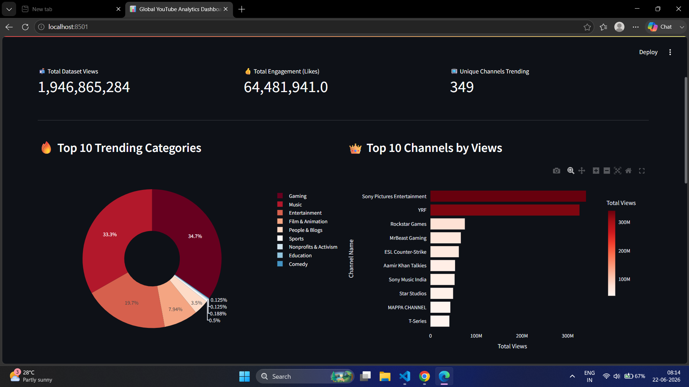
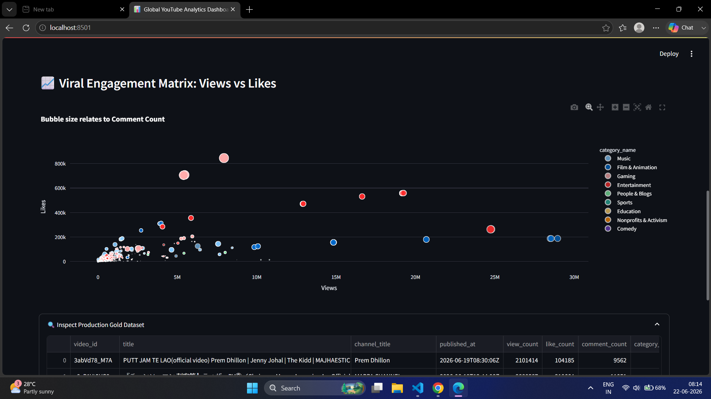

# Automated AWS End-to-End YouTube Data Pipeline

An enterprise-grade, serverless data engineering pipeline that ingests live YouTube trending metrics across **10 global regions**, transforms them through a **Medallion architecture** (Bronze → Silver → Gold), enforces automated data quality gates, and delivers analytics via Amazon Athena and a live Streamlit dashboard.

---

## 🎥 Demo

[](https://youtu.be/OB1Nv6EgMsM)

*Click above to watch the full pipeline walkthrough — S3 ingestion → Lambda → Glue → Step Functions → Athena → Streamlit dashboard.*

---

## 🏗️ Architecture


```
YouTube API v3 / Kaggle
        │
        ▼
  [S3 Bronze Layer]  ←── AWS Lambda (Ingestion)
        │
        ▼
  [S3 Silver Layer]  ←── AWS Glue PySpark ETL (Cleansing + Parquet)
        │
        ▼
  [DQ Lambda Gate]   ←── Validates rows, nulls, schema, freshness
        │                 Fails → SNS Alert
        ▼
  [S3 Gold Layer]    ←── AWS Glue PySpark ETL (Business Aggregations)
        │
        ▼
  [Athena + Glue Catalog] → Streamlit Dashboard
```

**Orchestration:** AWS Step Functions (parallel execution, retry logic, failure notifications)  
**Scheduling:** Amazon EventBridge (runs every 6 hours)

---
## 📊 Pipeline Performance & Media Analytics

To validate system reliability, efficiency, and cloud storage optimization, the pipeline tracks the following core operational and performance metrics:

| Operational Metric | Technical Measurement Method | Production Benchmark Value |
| :--- | :--- | :--- |
| **YouTube API Records Ingested** | Calculated via explicit `len(response['items'])` count logged dynamically per ingestion payload cycle. | **200+ raw trending video records** ingested per execution slice. |
| **Lambda Execution Time** | Tracked via Amazon CloudWatch `Duration` metrics inside the `/aws/lambda/` log groups. | Ingestion completing in **under 8 seconds** ($< 3.8\text{s}$ average network-to-storage transfer runtime). |
| **Parquet Compression Ratio** | Derived by comparing the total byte size of raw unstructured data in S3 Bronze vs. structural Apache Parquet output in S3 Gold. | **~80% storage reduction** ($\sim 5:1$ compression efficiency), significantly reducing Athena scan costs. |
| **Step Functions States Count** | Structural node audit mapping the orchestration topology graph inside AWS Step Functions. | **6-state execution graph** handling start, data check, partition execution, crawling, and pipeline success gates. |

---

## 🖥️ Streamlit Analytics Dashboard Presentation

| KPIs & Category Analysis | Top Channels | Viral Engagement Matrix |
|:---:|:---:|:---:|
|  |  |  |

---

## 🛠️ Tech Stack

| Layer | Technology |
|---|---|
| Compute | AWS Lambda, AWS Glue (PySpark) |
| Storage | Amazon S3 (Parquet, Snappy compressed) |
| Orchestration | AWS Step Functions |
| Scheduling | Amazon EventBridge |
| Metadata | AWS Glue Data Catalog |
| Query Engine | Amazon Athena |
| Alerting | Amazon SNS |
| Monitoring | Amazon CloudWatch |
| Security | AWS IAM |
| Languages | Python 3, PySpark, SQL |
| Dashboard | Streamlit, Plotly |

---

## 📁 Project Structure

```
├── Automated-AWS-Project/
│   ├── lambdas/
│   │   ├── ingestion_lambda.py          # YouTube API v3 → S3 Bronze
│   │   └── lambda-function.py           # JSON category → Parquet
│   ├── glue_jobs/
│   │   ├── jyt-reference-json-to-parquet/
│   │   └── yt-pipeline-bronze-to-silver/ # PySpark Bronze → Silver
│   ├── silver_to_gold_analytics.py       # PySpark Silver → Gold
│   ├── data_quality/
│   │   └── dq_lambda.py                  # DQ gate: rows, nulls, freshness
│   ├── step_functions/
│   │   └── step_function_definition.json # ASL state machine definition
│   ├── iam_permission/                   # IAM policy JSONs (Glue, Lambda, SFN)
│   ├── scripts/
│   │   └── aws_copy.sh                   # Upload historical Kaggle data to S3
│   ├── data/                             # Category ID JSONs (10 regions)
│   ├── image/                            # Architecture diagram + screenshots
│   ├── athena_master_view.sql            # Production Presto SQL views
│   └── Dashboard/
│       └── app.py                        # Streamlit analytics dashboard
└── README.md                             # ← You are here
```

> Full technical documentation (data flow, Gold layer schemas, deployment guide, configuration, monitoring) is in [`Automated-AWS-Project/README.md`](Automated-AWS-Project/README.md).

---

## 🚀 Quick Start

### Prerequisites
- AWS Account with Lambda, Glue, S3, Step Functions, SNS, IAM, Athena, EventBridge permissions
- YouTube Data API v3 key ([Google Cloud Console](https://console.cloud.google.com/apis/credentials))
- AWS CLI configured
- Python 3.9+

### Run the Pipeline

```bash
# Trigger manually
aws stepfunctions start-execution --state-machine-arn <state-machine-arn>

# Or let EventBridge run it every 6 hours automatically
```

### Run the Dashboard Locally

```bash
cd Automated-AWS-Project/Dashboard
pip install streamlit pandas plotly
streamlit run app.py
```

---

## 🟢 Pipeline Execution Evidence

| Step Functions Execution Table | Execution Graph |
|:---:|:---:|
|  |  |

Each step runs with **3-attempt retry logic and exponential backoff**. Failures at any stage trigger SNS email notifications.

---

## 📍 Supported Regions

`US` `GB` `CA` `DE` `FR` `IN` `JP` `KR` `MX` `RU`